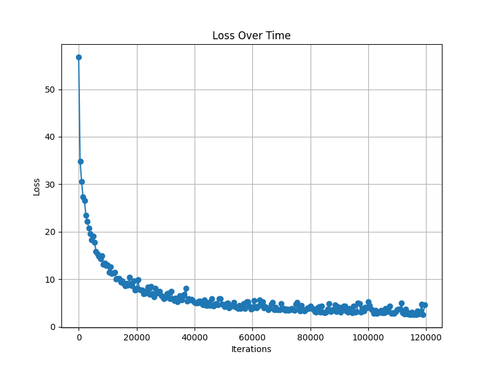

# Setup

These examples make extensive use of the `torchdiffeq` library. In particular, the function `odeint(func, y0, t, method)`, which is a ODE solver. Additionally, `PyTorch` is also used througout these demonstrations.

In order to install the necessary modules, run:
```bash
pip install -r requirements.txt
```

# Linear ODE

In this example, we will learn the dynamics of a linear ODE. The ODE is given by the following IVP:

$$
\begin{aligned}
&\dot{x} = \begin{bmatrix} -0.1 & -3.0 \\ 3.0 & -0.1 \end{bmatrix} x \\
&x(0) = \begin{bmatrix} 2.0 \\ 0.0 \end{bmatrix}
\end{aligned}
$$

To do so, we use a neural network with a hidden layer of 50 neurons, `tanh` activation function and 2 output neurons. 

Running this example with `--viz` flag on will create a directory with images of the approximation generated by the ODE_Net, a `.gif` with this sequence, and a plot of the learning curve.

To run it, use 
```bash
python linearODE.py --viz
```

Additional arguments for this script include:

* `--method` with options `dopri` or `adams` to choose which nuerical method is used to solve the IVPs

* `--data_size` which chooses the amount of points computed in each solution of the IVP

* `--batch_time` in each batch used in gradient descent, the solution is evaluated for instants in the interval `[0, batch_time]`

* `--batch_size` the amount of instances from the previous interval used in each batch

* `--niters` number of training iterations

* `--test_freq` frequency of image creation and loss print

* `--viz` whether or not to create images of the learning process

* `--gpu` option to enable training using the gpu. It only works if your machine is compatible with CUDA

* `--adjoing` in this simple example it is not necessary, but this options toggles the use of the adjoint method to 
backpropagate

* `--terminal_time` sets a different interval to evaluate the IVP's solution. By default is 25.

* `--dirname` which establishes the directory in which to store the images generated. It is only relevant if `--viz` 
is on, and it is `linearODE_learningProcess`by default

## Example run

Running `python linearODE.py --viz --dirname=application_examples/simple_systems/linearODE_learningProcess --niters=4000`,
we get the following comparison between the real solution and the approximation generated by the ODE_Net during the
training process:


The learning curve is also generated:

