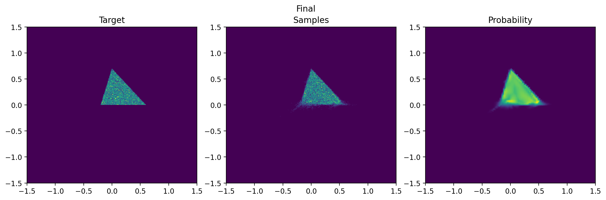
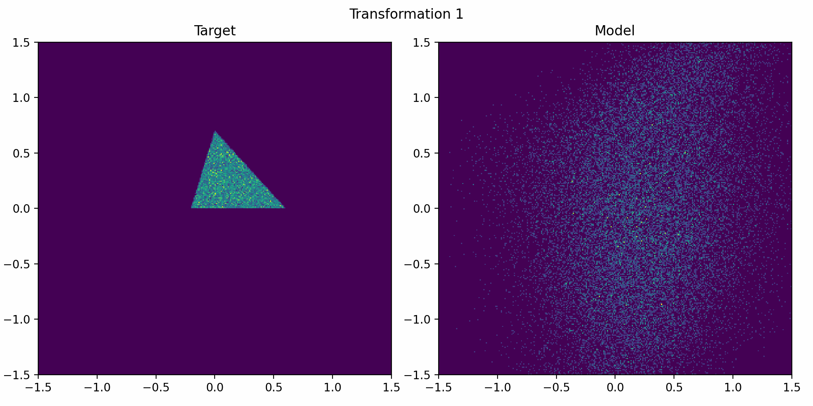
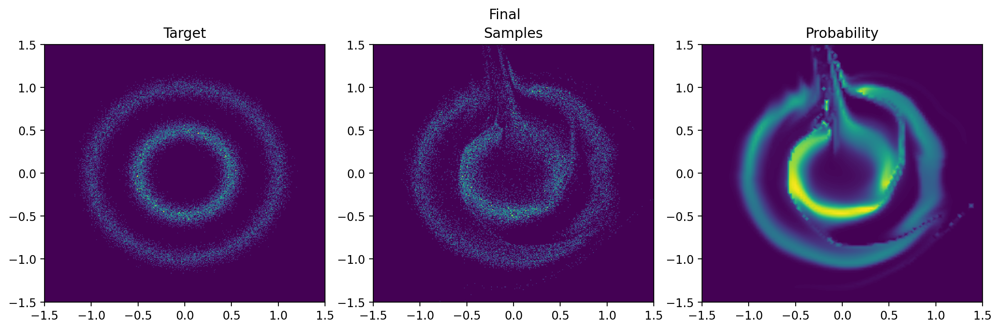
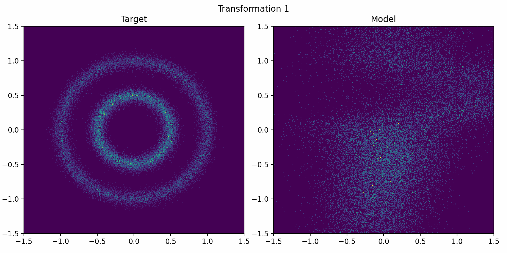

# Comparison of Normalizing Flows and Continuous Normalizing Flows

To better understand the merits of incorporating continuous-time dynamics to normalising flows, we compare
their performances on two simple toy datasets. The experiments can be found in the notebooks
[cnf_toy.ipynb](cnf_toy.ipynb) and [nf_toy.ipynb](nf_toy.ipynb).

## Uniform triangle distribution
|                                | NF      | CNF         |
|--------------------------------|---------|-------------|
| Number of trainable parameters | 804888  | **15904**   |
| Negative log-likelihood        | -1.1982 | **-1.2455** |

From the numbers it is clear the CNF is much more effective in terms of the number of parameters needed
to achieve a similar performance. Even then, the performance of CNF is slightly better than that of the NF.

The architectures of each model can be found in the respective notebooks. A few things to note:
- The CNF uses a hypernetwork to make the output change with time. The network used is a 3-layer MLP with 32
hidden units per layer and tanh activation. This network finds the parameters of the vector field.
- The NF uses a RealNVP architecture with coupling layers. In this example we use 6 coupling layers, each
with two networks: scale and translation. Both of them have 1 layer with 256 hidden units and LeakyReLU activation.

In addition, we can visualise the learned densities. The following figure shows the densities learned by
the NF and CNF, as well as the ground truth samples.

### NF results
#### Output of the model

#### Evolution through the transformations.

### CNF results

By comparing the images it is clear the CNF result is much cleaner and has been able to capture the 
density better using fewer parameters.

## Two concentric circles
|                                | NF      | CNF        |
|--------------------------------|---------|------------|
| Number of trainable parameters | 7404600 | **15904**  |
| Negative log-likelihood        | 0.9079  | **0.8128** |

Once again, the CNF is much more effective in terms of the number of parameters needed. In this case, to
achieve a similar performance, the NF needs 46.8 times more parameters than the CNF. Even then,
the performance is better for the CNF.

The architectures of each model can be found in the respective notebooks. A few things to note:
- The CNF architecture remains unchanged from the last example.
- The NF architecture is essentially the same as the last example, but with 14 coupling layers instead of 6.
Moreover, the scale and translation networks now have 4 layers each.

Lastly, let's compare the visual results.

### NF results
#### Output of the model

#### Evolution through the transformations.

### CNF results

Like before, by comparing the images it is clear the CNF result is much cleaner and has been able to capture the 
density better using fewer parameters.